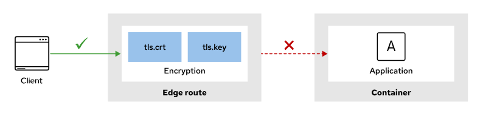
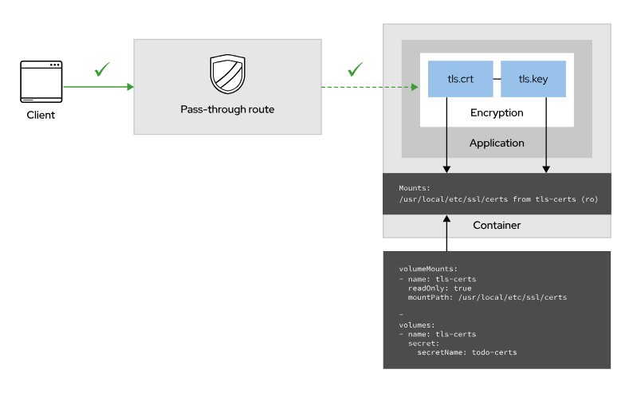
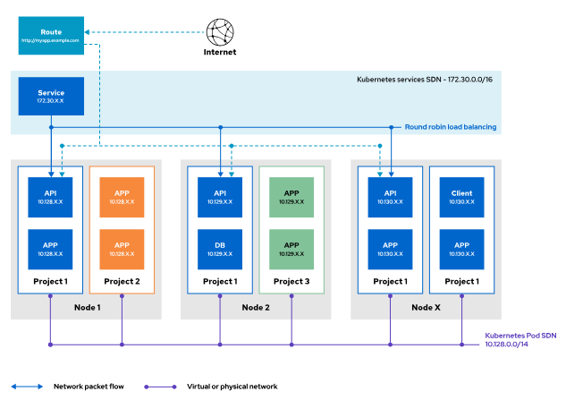
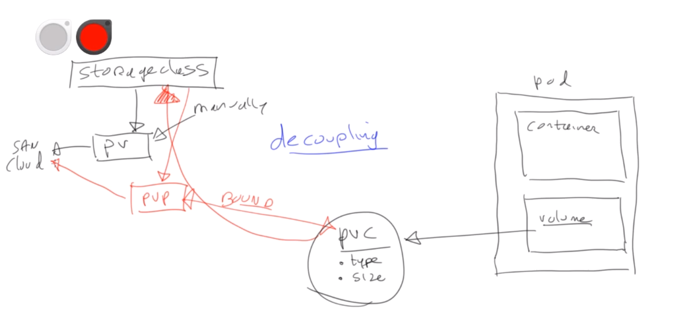

# RedHat EX DO280 (Red Hat Certified Specialist in OpenShift Administration ) Notes 

Songs: 
- [| C I T Y N I G H T S | - A NewRetroWave Mix | 1 Hour | Synthwave/ Retrowave/ Darksynth |
](https://www.youtube.com/watch?v=WhjuZUlcmk0)
- [| O U T L A W | - A NewRetroWave Mix | 1 Hour | Retrowave/ Synthwave/ Outrun |
](https://www.youtube.com/watch?v=0ZQoqvRtiaM)

## About the exam

- Exam format: task based. The exam itself contains a set of tasks (16) that you have to perform, which represents the tasks for an OpenShift administrator.

- Exam duration: 3 hours

- Exam passing grade: 70% - you must got 12 questions right out of 16. (note that partial completion of a question is not counted as a correct answer)

## Exam objectives

These objectives was retrieved from [EX280](https://www.redhat.com/en/services/training/red-hat-certified-openshift-administrator-exam?section=objectives).

To become a Red Hat Certified Specialist in OpenShift Administration, you should be able to perform these tasks:

- **Manage OpenShift Container Platform**
  - Use the web console to manage and configure an OpenShift cluster
  - Use the command-line interface to manage and configure an OpenShift cluster
  - Query, format, and filter attributes of Kubernetes resources
  - Import, export, and configure Kubernetes resources
  - Locate and examine container images
  - Create and delete projects
  - Examine resources and cluster status
  - View logs
  - Monitor cluster events and alerts
  - Assess the health of an OpenShift cluster
  - Troubleshoot common container, pod, and cluster events and alerts
  - Use product documentation

- **Deploy Applications**
  - Deploy applications from resource manifests
  - Use Kustomize overlays to modify application configurations
  - Deploy applications from images, OpenShift templates, and Helm charts
  - Deploy jobs to perform one-time tasks
  - Manage application deployments
  - Work with replica sets
  - Work with labels and selectors
  - Configure services
  - Expose both HTTP and non-HTTP applications to external access
  - Work with operators such as MetalLB and Multus

- **Manage Storage for Application Configuration and Data**
  - Create and use secrets
  - Create and use configuration maps
  - Provision Persistent Storage volumes for block and file-based data
  - Use storage classes
  - Manage non-shared storage with StatefulSets

- **Configure Applications for Reliability**
  - Configure and use health probes
  - Reserve and limit application compute capacity
  - Scale applications to meet increased demand

- **Manage Application Updates**
  - Identify images using tags and digests
  - Roll back failed deployments
  - Manage image streams
  - Use triggers to manage images

- **Manage Authentication and Authorization**
  - Configure the HTPasswd identity provider for authentication
  - Create and delete users
  - Modify user passwords
  - Create and manage groups
  - Modify user and group permissions

- **Configure Network Security**
  - Configure networking components
  - Troubleshoot software defined networking
  - Create and edit external routes
  - Control cluster network ingress
  - Secure external and internal traffic using TLS certificates
  - Configure application network policies

- **Enable Developer Self-Service**
  - Configure cluster resource quotas
  - Configure project quotas
  - Configure project resource requirements
  - Configure project limit ranges
  - Configure project templates

- **Manage OpenShift Operators**
  - Install an operator
  - Delete an operator

- **Configure Application Security**
  - Configure and manage service accounts
  - Run privileged applications
  - Create service accounts
  - Manage and apply permissions using security context constraints
  - Create and apply secrets to manage sensitive information
  - Configure application access to Kubernetes APIs
  - Configure Kubernetes CronJobs


## Get started with OpenShift Local
- [Guide](https://www.redhat.com/sysadmin/install-openshift-local)

## Manage OpenShift Container Platform

Executing troubleshooting commands:

- Getting node informations:
```
oc get node
oc describe node <nodename>
```

- Getting busiest nodes
```
oc adm top nodes
```

- Getting `journalctl` logs from a node
```
oc adm node-logs -u kubelet my-node-name
```

- Running a remote shell for a node
```
oc debug node/<nodename>
```

- Work with cluster installers
```
oc get clusteroperators
oc get clusterversion -o yaml
```

- Getting a pod logs
```
oc logs <pod> [-c <container>] [-f]
```

- Debugging a deployment or a pod
```
oc debug deployment/<deplname> [--as-root]
oc rsh <podname>
oc port-forward <pod> <localport>:<remoteport>
```

- Getting a file from a pod
```
oc cp file <pod>:/file
oc cp <pod>:/file file
```

## Manage Users and Policies

Removing the default kubeadmin:
```
oc delete secret kubeadmin -n kube-system
```

Working with htpasswd

- Create: `htpasswd -c -B -b /tmp/htpasswd luiz redhat123`
- Update: `htpasswd -b /tmp/htpasswd luiz redhat1234`
- Delete: `htpasswd -D /tmp/htpasswd luiz`

Create a secret:
```
oc create secret generic htpasswd-secret \
> --from-file htpasswd=/tmp/htpasswd -n openshift-config
```
Extract the secret content: 
```
oc extract secrets/htpasswd-secret --to=-
```

Adding to OAuth:
```yaml
apiVersion: config.openshift.io/v1
kind: OAuth
metadata:
  name: cluster
spec:
  identityProviders:
  - name: my_htpasswd_provider
    mappingMethod: claim
    type: HTPasswd
    htpasswd:
      fileData:
        name: htpasswd-secret
```
or 

```yaml
apiVersion: config.openshift.io/v1
kind: OAuth
...output omitted...
spec:
  identityProviders:
  - ldap:
...output omitted...
    type: LDAP
  - htpasswd:
      fileData:
        name: localusers
    mappingMethod: claim
    name: myusers
    type: HTPasswd
```

the authentication pods should be restarted 
```
oc get pods -n openshift-authentication
```

## Managing secrets 

**In openshift secrets are mainly used for two reasons:**
- To store credentials which is used by pods in a microservice architecture
- To store TLS certificates and Keys
- A TLS secret stores the certificate as tls.crt and the certificate key as tls.key
- Developer can mount and secret and create a passthrough route 
- 
**Different types of secrets:**
- docker-registry 
- generic
- tls
when information is stored in a secret, Openshift validates that the data conforms to the type of secret. 

```bash
luiz---------------->>>$oc create secret generic mysql --from-literal user=sqluser --from-literal password=password1 --from-literal database=secretdb --from-literal hostname=mysql --from-literal root_password=password
secret/mysql created
luiz---------------->>>$oc get secrets | grep mysql
mysql                      Opaque                                5      37s

luiz---------------->>>$oc new-app --name mysql --image bitnami/mysql 
--> Found container image 556d0e7 (4 weeks old) from Docker Hub for "bitnami/mysql"

    * An image stream tag will be created as "mysql:latest" that will track this image

--> Creating resources ...
    imagestream.image.openshift.io "mysql" created
    deployment.apps "mysql" created
    service "mysql" created
--> Success
    Application is not exposed. You can expose services to the outside world by executing one or more of the commands below:
     'oc expose service/mysql' 
    Run 'oc status' to view your app.

luiz---------------->>>$oc get pods
NAME                     READY   STATUS             RESTARTS      AGE
mysql-548f9f9664-drg2b   0/1     CrashLoopBackOff   2 (24s ago)   65s
postgresql-1-nkm8v       0/1     Running            0             5s
luiz---------------->>>$oc logs mysql-548f9f9664-drg2b
mysql 14:05:23.35 INFO  ==> 
mysql 14:05:23.35 INFO  ==> Welcome to the Bitnami mysql container
mysql 14:05:23.35 INFO  ==> Subscribe to project updates by watching https://github.com/bitnami/containers
mysql 14:05:23.36 INFO  ==> Submit issues and feature requests at https://github.com/bitnami/containers/issues
mysql 14:05:23.36 INFO  ==> Upgrade to Tanzu Application Catalog for production environments to access custom-configured and pre-packaged software components. Gain enhanced features, including Software Bill of Materials (SBOM), CVE scan result reports, and VEX documents. To learn more, visit https://bitnami.com/enterprise
mysql 14:05:23.36 INFO  ==> 
mysql 14:05:23.36 INFO  ==> ** Starting MySQL setup **
mysql 14:05:23.38 INFO  ==> Validating settings in MYSQL_*/MARIADB_* env vars
mysql 14:05:23.38 ERROR ==> The MYSQL_ROOT_PASSWORD environment variable is empty or not set. Set the environment variable ALLOW_EMPTY_PASSWORD=yes to allow the container to be started with blank passwords. This is recommended only for development.

luiz---------------->>>$oc set env deployment/mysql --from secret/mysql --prefix MYSQL_
deployment.apps/mysql updated
luiz---------------->>>$oc get pods
NAME                     READY   STATUS        RESTARTS      AGE
mysql-548f9f9664-drg2b   0/1     Terminating   5 (23s ago)   3m58s
mysql-59db5b8bf6-dxd79   1/1     Running       0             3s
luiz---------------->>>$

luiz---------------->>>$oc describe secret mysql
Name:         mysql
Namespace:    ex280-users-authentication
Labels:       <none>
Annotations:  <none>

Type:  Opaque

Data
====
user:           7 bytes
database:       8 bytes
hostname:       5 bytes
password:       9 bytes
root_password:  8 bytes

luiz---------------->>>$oc exec -it mysql-59db5b8bf6-dxd79 -- env | grep -iE mysql
HOSTNAME=mysql-59db5b8bf6-dxd79
MYSQL_HOSTNAME=mysql
MYSQL_PASSWORD=password1
MYSQL_ROOT_PASSWORD=password
MYSQL_USER=sqluser
MYSQL_DATABASE=secretdb
MYSQL_PORT_3306_TCP_PORT=3306
MYSQL_SERVICE_PORT=3306
MYSQL_PORT=tcp://10.217.4.221:3306
MYSQL_PORT_3306_TCP=tcp://10.217.4.221:3306
MYSQL_PORT_3306_TCP_PROTO=tcp
MYSQL_SERVICE_HOST=10.217.4.221
MYSQL_SERVICE_PORT_3306_TCP=3306
MYSQL_PORT_3306_TCP_ADDR=10.217.4.221
BITNAMI_APP_NAME=mysql
```

### Getting users and identities
```
oc get users
oc get identity
```
## Manage Resource Access
Defining and Applying Permissions Using RBAC  
```
oc adm policy add-cluster-role-to-user cluster-admin username
oc adm policy remove-cluster-role-from-user cluster-admin username
oc adm policy who-can delete user
oc adm policy add-role-to-user basic-user dev -n wordpress
```

Default roles
-	**basic-user** Users with this role have read access to the project.
-	**cluster-admin** Users with this role have superuser access to the cluster resources. These users can perform any action on the cluster, and have full control of all projects.
-	**cluster-status** Users with this role can get cluster status information.
-	**self-provisioner** Users with this role can create new projects.
Default roles that can be added or removed from a project level:
-	**admin** Users with this role can manage all project resources, including granting access to other users to the project.
-	**edit** Users with this role can create, change, and delete common application resources from the project, such as services and deployment configurations. These users cannot act on management resources such as limit ranges and quotas, and cannot manage access permissions to the project.
-	**view** Users with this role can view project resources, but cannot modify project resources.

System users: system:admin, system:openshift-registry, and system:node:node1.example.com.
Managing Sensitive Information with Secrets  
```
oc create secret generic secret_name \
> --from-literal key1=secret1 \
> --from-literal key2=secret2
oc secrets add --for mount serviceaccount/serviceaccount-name \
> secret/secret_name
oc set env dc/demo --from=secret/demo-secret
oc set volume dc/demo \
> --add \
> --type=secret \
> --secret-name=demo-secret \
> --mount-path=/app-secrets
```

### Difference between add-cluster-role-to-user and add-role-to-user

1. oc adm policy add-cluster-role-to-user
Cluster-wide scope: This command is used to assign cluster roles, which apply across the entire OpenShift cluster.

- **Cluster role:** A cluster role is a role that is defined at the cluster level and can provide permissions that apply to all projects (namespaces) in the cluster.

- **Use case:** You would use this command to assign roles like cluster-admin or other roles that grant access across all namespaces, nodes, or the cluster as a whole.

```shell
oc adm policy add-cluster-role-to-user cluster-admin user1
```

2. oc adm policy add-role-to-user
Namespace scope: This command is used to assign a role that is scoped to a specific namespace (project).

- **Role:** A role is limited to a particular namespace, providing permissions only within that namespace.

- **Use case:** You would use this command when you want to assign roles like admin, edit, or view to users for specific projects.

**Example:**
```
oc adm policy add-role-to-user admin user1 -n myproject
```
This command gives user1 the admin role in the myproject namespace.


Controlling Application Permissions with Security Context Constraints (SCCs) (anyuid, privileged etc)  
```
oc adm policy add-scc-to-user anyuid -z default
```

### Remove the Capability to Create Projects for All Regular Users

Removing the `self-provisioner` cluster role from authenticated users and groups denies permissions for self-provisioning any new projects:
```
$ oc adm policy remove-cluster-role-from-group self-provisioner system:authenticated:oauth
```
Try creating a new project with a regular user, it should fail:
```
$ oc login -u alice -p password1
$ oc new-project project1
Error from server (Forbidden): You may not request a new project via this API.
```
### Create Cluster Admin
```
$ oc adm policy add-cluster-role-to-user cluster-admin admin
```

### Create a New Project
Create two new projects:
```
$ oc new-project project1 \
  --description="Alice OpenShift Project" \
  --display-name="Playground for Alice"
```
```
$ oc new-project project2 \
  --description="Vince OpenShift Project" \
  --display-name="Playground for Vince"
```

View project details:
```yaml
$ oc describe project/project1
Name:			project1
Created:		2 minutes ago
Labels:			<none>
Annotations:		openshift.io/description=Alice OpenShift Project
			openshift.io/display-name=Playground for Alice
			openshift.io/requester=system:admin
			openshift.io/sa.scc.mcs=s0:c13,c12
			openshift.io/sa.scc.supplemental-groups=1000180000/10000
			openshift.io/sa.scc.uid-range=1000180000/10000
Display Name:		Playground for Alice
Description:		Alice OpenShift Project
Status:			Active
Node Selector:		<none>
Quota:			<none>
Resource
```

Associate a User with a Project
Add alice as an administrator for the `project1` project:
```
$ oc policy add-role-to-user admin alice -n project1
```

Add vince a developer for the `project2` project:
```
$ oc policy add-role-to-user edit vince -n project2
```

Add alice to have read access to the `project2` project:
```
$ oc policy add-role-to-user view alice -n project2
```

### View Local Role Bindings for a Project
```
$ oc describe rolebinding.rbac -n project1
```

### Creating roles and cluster roles 

```shell
luiz---------------->>>$oc create role  podview --verb=get --resource=pod -n ex280-developers 
role.rbac.authorization.k8s.io/podview created
luiz---------------->>>$
luiz---------------->>>$
luiz---------------->>>$oc get role
No resources found in ex280-users-authentication namespace.
luiz---------------->>>$oc get role -n ex280-developers 
NAME      CREATED AT
podview   2024-10-12T13:14:54Z
luiz---------------->>>$oc project ex280-developers 
Now using project "ex280-developers" on server "https://api.crc.testing:6443".
luiz---------------->>>$oc get roles
NAME      CREATED AT
podview   2024-10-12T13:14:54Z
luiz---------------->>>$oc adm policy add-role-to-user podview lisa --role-namespace=ex280-developers -n ex280-developers
luiz---------------->>>$oc login -u lisa 
Logged into "https://api.crc.testing:6443" as "lisa" using existing credentials.

You have access to the following projects and can switch between them with 'oc project <projectname>':

    ex280-developers
  * ex280-users-authentication

Using project "ex280-users-authentication".
luiz---------------->>>$oc get pods -n ex280-developers
No resources found in ex280-developers namespace.
```

#### Creating a cluster role

Cluster role verbs define the specific actions that users or service accounts are allowed to perform on Kubernetes or OpenShift resources. 

**Common Cluster Role Verbs:**
1. **get**:
   - Allows reading or retrieving a specific resource (e.g., a Pod, Service, Namespace).
   - Example: Viewing the details of a single resource.

2. **list**:
   - Allows listing multiple resources of a specific type.
   - Example: Listing all Pods in a namespace.

3. **watch**:
   - Allows subscribing to updates about changes to a resource (e.g., watching for changes to a Pod or Namespace in real-time).
   - Example: Monitoring a resource for changes without having to repeatedly query it.

4. **create**:
   - Allows creating new instances of a resource.
   - Example: Creating a new Pod or Service.

5. **update**:
   - Allows modifying existing resources.
   - Example: Updating the specification of a Deployment or Service.

6. **patch**:
   - Allows applying a partial update to a resource.
   - Example: Patching specific fields of a resource without replacing the entire resource.

7. **delete**:
   - Allows deleting resources.
   - Example: Deleting a Pod or a Namespace.

8. **deletecollection**:
   - Allows deleting a collection of resources all at once.
   - Example: Deleting all Pods that match certain criteria.

9. **edit**:
   - A higher-level verb that implies creating, deleting, and updating resources. This is often used in more general roles (though it’s not a specific verb in YAML).
   - Note: This is typically used in default roles but isn’t an actual verb that can be set in the YAML.

10. **bind**:
    - Allows granting roles or bindings to other users or service accounts.
    - Example: Assigning RBAC permissions to others.

11. **impersonate**:
    - Allows acting as another user, group, or service account.
    - Example: Impersonating another user for debugging or testing purposes.

12. **escalate**:
    - Allows increasing or "escalating" privileges, typically to assign roles that the current user might not already have.
    - Example: Granting higher permissions than what a user is allowed to assign to themselves or others.


```yaml
luiz---------------->>>$oc create clusterrole podviewonly --verb=get --resource=pod --dry-run=client -o yaml 
apiVersion: rbac.authorization.k8s.io/v1
kind: ClusterRole
metadata:
  creationTimestamp: null
  name: podviewonly
rules:
- apiGroups:
  - ""
  resources:
  - pods
  verbs:
  - get

luiz---------------->>>$oc adm policy add-cluster-role-to-user podviewonly pereira
clusterrole.rbac.authorization.k8s.io/podviewonly added: "pereira"
```

**Creating a clusterrolebinding**
```yaml 
luiz---------------->>>$oc create clusterrolebinding cluster-admin-role-ex280 --clusterrole=view --group=developers
clusterrolebinding.rbac.authorization.k8s.io/cluster-admin-role-ex280 created
luiz---------------->>>$oc get groups
NAME            USERS
administrator   luiz
developers      bob, john
linux           lisa
luiz---------------->>>$oc login -u bob
Logged into "https://api.crc.testing:6443" as "bob" using existing credentials.

You have access to 70 projects, the list has been suppressed. You can list all projects with 'oc projects'

Using project "ex280-users-authentication".
```

ClusterRole for developers:
This rule allows developers to perform get, list, and watch actions on namespaces, but it excludes those prefixed with openshift-.
```yaml
apiVersion: rbac.authorization.k8s.io/v1
kind: ClusterRole
metadata:
  name: developer-view-projects
rules:
  - apiGroups: [""]  # "" indicates the core API group (for resources like pods, services, etc.)
    resources: ["namespaces"]
    verbs: ["get", "list", "watch"]
    resourceNames:
      - "!openshift-*"
```

```yaml
luiz---------------->>>$oc get clusterrolebindings | grep ex280
cluster-admin-role-ex280                                                    ClusterRole/view                                                                        5m
luiz---------------->>>$oc delete clusterrolebindings cluster-admin-role-ex280
clusterrolebinding.rbac.authorization.k8s.io "cluster-admin-role-ex280" deleted
```

### Security Context Constraints (SCCs)
List security context constraints
```
$ oc get scc | awk '{ print $1 }'
NAME
anyuid
hostaccess
hostmount-anyuid
hostnetwork
nonroot
privileged
restricted
```

### Create a Service Account

- A Service account SA is a user account used by  a pod to determine pod access privileges to system resources
- The default serviceaccount used by pods allows for very limited access to cluster resources
- Sometimes a Pod cannont run with this very restricted ServiceAcccount
- After creating the ServiceAccount, specific access privileges need to be set

Create a service account apache-account:

- Optionally, add `-n namespace` to assign the SA to a specific namespace
- After creating the SA, use a role binding to connect the SA to a specific role

```
$ oc create serviceaccount apache-account
```
Associate the new service account with the `anyuid` security context:
```
$ oc adm policy add-scc-to-user anyuid -z apache-account
```
Edit the deployment config for apache:
```
$ oc edit dc/apache
```
Add the service account definition:
```yaml
spec:
  template:
    spec:
      serviceAccountName: apache-account
```
### Security Context Constraints 

- A security context constraint SCC is an OpenShift resource, similar to the Kubernetes Security Context resource, that restricts access to resources
- The purpose is to limit access from a Pod to the host environment
- Different SCCs are available to control:
- - Running privileged containers
- - Requesting Additional capabilities to a container
- - Using host directories as volumes
- - Changind SELinux context of a container
- - Changing the user ID
- Use SCCs may be necessary to run community containers that by default don't work under the right OpenShift security restrictions

Commands:
```bash
oc get scc 
oc describe scc <scc-name>
oc describe pod <podname> | grep scc
```

if a pod can't run due to an SCC, use: 
```bash
oc get pod <name> -o yaml | oc adm policy scc-subject-review -f -
```

```bash
luiz---------------->>>$oc get scc
NAME                              PRIV    CAPS                   SELINUX     RUNASUSER          FSGROUP     SUPGROUP    PRIORITY     READONLYROOTFS   VOLUMES
anyuid                            false   <no value>             MustRunAs   RunAsAny           RunAsAny    RunAsAny    10           false            ["configMap","csi","downwardAPI","emptyDir","ephemeral","persistentVolumeClaim","projected","secret"]
hostaccess                        false   <no value>             MustRunAs   MustRunAsRange     MustRunAs   RunAsAny    <no value>   false            ["configMap","csi","downwardAPI","emptyDir","ephemeral","hostPath","persistentVolumeClaim","projected","secret"]
hostmount-anyuid                  false   <no value>             MustRunAs   RunAsAny           RunAsAny    RunAsAny    <no value>   false            ["configMap","csi","downwardAPI","emptyDir","ephemeral","hostPath","nfs","persistentVolumeClaim","projected","secret"]
hostnetwork                       false   <no value>             MustRunAs   MustRunAsRange     MustRunAs   MustRunAs   <no value>   false            ["configMap","csi","downwardAPI","emptyDir","ephemeral","persistentVolumeClaim","projected","secret"]
hostnetwork-v2                    false   ["NET_BIND_SERVICE"]   MustRunAs   MustRunAsRange     MustRunAs   MustRunAs   <no value>   false            ["configMap","csi","downwardAPI","emptyDir","ephemeral","persistentVolumeClaim","projected","secret"]
hostpath-provisioner              true    <no value>             RunAsAny    RunAsAny           RunAsAny    RunAsAny    <no value>   false            ["*"]
machine-api-termination-handler   false   <no value>             MustRunAs   RunAsAny           MustRunAs   MustRunAs   <no value>   false            ["downwardAPI","hostPath"]
nonroot                           false   <no value>             MustRunAs   MustRunAsNonRoot   RunAsAny    RunAsAny    <no value>   false            ["configMap","csi","downwardAPI","emptyDir","ephemeral","persistentVolumeClaim","projected","secret"]
nonroot-v2                        false   ["NET_BIND_SERVICE"]   MustRunAs   MustRunAsNonRoot   RunAsAny    RunAsAny    <no value>   false            ["configMap","csi","downwardAPI","emptyDir","ephemeral","persistentVolumeClaim","projected","secret"]
privileged                        true    ["*"]                  RunAsAny    RunAsAny           RunAsAny    RunAsAny    <no value>   false            ["*"]
restricted                        false   <no value>             MustRunAs   MustRunAsRange     MustRunAs   RunAsAny    <no value>   false            ["configMap","csi","downwardAPI","emptyDir","ephemeral","persistentVolumeClaim","projected","secret"]
restricted-v2                     false   ["NET_BIND_SERVICE"]   MustRunAs   MustRunAsRange     MustRunAs   RunAsAny    <no value>   false            ["configMap","csi","downwardAPI","emptyDir","ephemeral","persistentVolumeClaim","projected","secret"]

luiz---------------->>>$oc describe scc/anyuid
Name:						anyuid
Priority:					10
Access:						
  Users:					<none>
  Groups:					system:cluster-admins
Settings:					
  Allow Privileged:				false
  Allow Privilege Escalation:			true
  Default Add Capabilities:			<none>
  Required Drop Capabilities:			MKNOD
  Allowed Capabilities:				<none>
  Allowed Seccomp Profiles:			<none>
  Allowed Volume Types:				configMap,csi,downwardAPI,emptyDir,ephemeral,persistentVolumeClaim,projected,secret
  Allowed Flexvolumes:				<all>
  Allowed Unsafe Sysctls:			<none>
  Forbidden Sysctls:				<none>
  Allow Host Network:				false
  Allow Host Ports:				false
  Allow Host PID:				false
  Allow Host IPC:				false
  Read Only Root Filesystem:			false
  Run As User Strategy: RunAsAny		
    UID:					<none>
    UID Range Min:				<none>
    UID Range Max:				<none>
  SELinux Context Strategy: MustRunAs		
    User:					<none>
    Role:					<none>
    Type:					<none>
    Level:					<none>
  FSGroup Strategy: RunAsAny			
    Ranges:					<none>
  Supplemental Groups Strategy: RunAsAny	
    Ranges:					<none>


luiz---------------->>>$oc run pod --image=nginx
Warning: would violate PodSecurity "restricted:v1.24": allowPrivilegeEscalation != false (container "pod" must set securityContext.allowPrivilegeEscalation=false), unrestricted capabilities (container "pod" must set securityContext.capabilities.drop=["ALL"]), runAsNonRoot != true (pod or container "pod" must set securityContext.runAsNonRoot=true), seccompProfile (pod or container "pod" must set securityContext.seccompProfile.type to "RuntimeDefault" or "Localhost")
pod/pod created
luiz---------------->>>$oc get pod pod -o yaml | oc adm policy scc-subject-review  -f - 
RESOURCE   ALLOWED BY   
Pod/pod    anyuid       
luiz---------------->>>$oc get pod
NAME   READY   STATUS    RESTARTS   AGE
pod    1/1     Running   0          50s


luiz---------------->>>$oc adm policy who-can delete-user delete deployment
Warning: the server doesn't have a resource type 'delete'
resourceaccessreviewresponse.authorization.openshift.io/<unknown> 

Namespace: ex280-lesson6-lab
Verb:      delete-user
Resource:  delete

Users:  kubeadmin
        luiz
        system:admin
..............
```

Running a pod as an specific SCC

```bash
luiz---------------->>>$oc new-app --name scc-nginx --image nginx:latest
--> Found container image 7f553e8 (9 days old) from Docker Hub for "nginx:latest"

    * An image stream tag will be created as "scc-nginx:latest" that will track this image

--> Creating resources ...
    imagestream.image.openshift.io "scc-nginx" created
    deployment.apps "scc-nginx" created
    service "scc-nginx" created
--> Success
    Application is not exposed. You can expose services to the outside world by executing one or more of the commands below:
     'oc expose service/scc-nginx' 
    Run 'oc status' to view your app.
luiz---------------->>>$oc get deployments
NAME        READY   UP-TO-DATE   AVAILABLE   AGE
scc-nginx   0/1     1            0           4s
luiz---------------->>>$oc get pods
NAME                         READY   STATUS             RESTARTS     AGE
httpd                        1/1     Running            0            6m8s
pod                          1/1     Running            0            8m9s
scc-nginx-589558495f-sjfg4   0/1     CrashLoopBackOff   1 (3s ago)   6s
luiz---------------->>>$oc logs scc-nginx-589558495f-sjfg4
/docker-entrypoint.sh: /docker-entrypoint.d/ is not empty, will attempt to perform configuration
/docker-entrypoint.sh: Looking for shell scripts in /docker-entrypoint.d/
/docker-entrypoint.sh: Launching /docker-entrypoint.d/10-listen-on-ipv6-by-default.sh
10-listen-on-ipv6-by-default.sh: info: can not modify /etc/nginx/conf.d/default.conf (read-only file system?)
/docker-entrypoint.sh: Sourcing /docker-entrypoint.d/15-local-resolvers.envsh
/docker-entrypoint.sh: Launching /docker-entrypoint.d/20-envsubst-on-templates.sh
/docker-entrypoint.sh: Launching /docker-entrypoint.d/30-tune-worker-processes.sh
/docker-entrypoint.sh: Configuration complete; ready for start up
2024/10/12 14:34:30 [warn] 1#1: the "user" directive makes sense only if the master process runs with super-user privileges, ignored in /etc/nginx/nginx.conf:2
nginx: [warn] the "user" directive makes sense only if the master process runs with super-user privileges, ignored in /etc/nginx/nginx.conf:2
2024/10/12 14:34:30 [emerg] 1#1: mkdir() "/var/cache/nginx/client_temp" failed (13: Permission denied)
nginx: [emerg] mkdir() "/var/cache/nginx/client_temp" failed (13: Permission denied)

luiz---------------->>>$oc create sa ex-nginx
serviceaccount/ex-nginx created

luiz---------------->>>$oc get sa
NAME       SECRETS   AGE
builder    1         6m56s
default    1         6m56s
deployer   1         6m55s
ex-nginx   1         3s

luiz---------------->>>$oc adm policy add-scc-to-user anyuid -z ex-nginx
clusterrole.rbac.authorization.k8s.io/system:openshift:scc:anyuid added: "ex-nginx"

luiz---------------->>>$oc set serviceaccount deployment/scc-nginx ex-nginx
deployment.apps/scc-nginx serviceaccount updated

luiz---------------->>>$oc get pods
NAME                         READY   STATUS             RESTARTS      AGE
httpd                        1/1     Running            0             10m
pod                          1/1     Running            0             12m
scc-nginx-56ff4dc4c9-gms4s   0/1     CrashLoopBackOff   3 (50s ago)   100s
scc-nginx-589558495f-sjfg4   0/1     CrashLoopBackOff   5 (50s ago)   4m2s

luiz---------------->>>$oc get deployment
NAME        READY   UP-TO-DATE   AVAILABLE   AGE
scc-nginx   0/1     1            0           4m11s

luiz---------------->>>$oc rollout restart deployment scc-nginx
deployment.apps/scc-nginx restarted
luiz---------------->>>$oc get pods
NAME                         READY   STATUS              RESTARTS      AGE
httpd                        1/1     Running             0             10m
pod                          1/1     Running             0             12m
scc-nginx-56ff4dc4c9-gms4s   0/1     CrashLoopBackOff    4 (13s ago)   118s
scc-nginx-7fd8995d49-f742l   0/1     ContainerCreating   0             2s

luiz---------------->>>$oc get pods
NAME                         READY   STATUS    RESTARTS   AGE
httpd                        1/1     Running   0          10m
pod                          1/1     Running   0          12m
scc-nginx-7fd8995d49-f742l   1/1     Running   0          6s
luiz---------------->>>$

luiz---------------->>>$oc get pod scc-nginx-7fd8995d49-f742l -o yaml | oc adm policy scc-subject-review -f - 
RESOURCE                         ALLOWED BY   
Pod/scc-nginx-7fd8995d49-f742l   anyuid 
```
#### Running Containers as Non-root

- By default, OpenShift denies containers to run as root
- Many containers run as root by default
- A container that runs as root has root privileges on the container host as well, and should be avoided
- If you build your own container images, specify which user it should run
- Frequently, non-root alternatives are available for the images you're using
- - quay.io images are made with OpenShift in Mind
- - bitnami has reworked commom images to be started as non-root
- Non-root containers cannont bind to a privileged port
- In OpenShift, this is not an issue, as containers are accessed through services and routes
- Configure the port on the service/route, not on the pod
- Also, non-root container will have limitations accessing files


**ServiceAccount and runAsUser Interaction:**
* Kubernetes: If you specify a ServiceAccount without a runAsUser, the Pod will run with the UID defined by the container image, unless a PodSecurityPolicy applies that specifies a different runAsUser.
* OpenShift: In OpenShift, if you use a ServiceAccount, the runAsUser might be automatically assigned based on the SecurityContextConstraints (SCC) applied to that ServiceAccount. 
* * For example, a restricted SCC may enforce a particular UID range, which applies to all Pods that use that ServiceAccount, unless explicitly overridden.

```bash
luiz---------------->>>$oc new-app --image bitnami/nginx:latest --name=nginx
--> Found container image c15e168 (9 days old) from Docker Hub for "bitnami/nginx:latest"

    * An image stream tag will be created as "nginx:latest" that will track this image

--> Creating resources ...
    imagestream.image.openshift.io "nginx" created
    deployment.apps "nginx" created
    service "nginx" created
--> Success
    Application is not exposed. You can expose services to the outside world by executing one or more of the commands below:
     'oc expose service/nginx' 
    Run 'oc status' to view your app.
luiz---------------->>>$oc get svc
NAME    TYPE        CLUSTER-IP     EXTERNAL-IP   PORT(S)             AGE
nginx   ClusterIP   10.217.5.171   <none>        8080/TCP,8443/TCP   15s

```


Example: Using a ServiceAccount Without runAsUser:

```yaml
apiVersion: apps/v1
kind: Deployment
metadata:
  name: example-deployment
spec:
  replicas: 1
  selector:
    matchLabels:
      app: example
  template:
    metadata:
      labels:
        app: example
    spec:
      serviceAccountName: my-serviceaccount  # Specifying the ServiceAccount
      containers:
        - name: my-app
          image: my-app-image
```
If no runAsUser is specified, Kubernetes/OpenShift will either:
* Use the default UID of the container image.
* Use the UID enforced by the SCC or PodSecurityPolicy applied to the ServiceAccount.

Example: Using a ServiceAccount with runAsUser:
```yaml
apiVersion: apps/v1
......
    spec:
      serviceAccountName: my-serviceaccount
      containers:
        - name: my-app
          image: my-app-image
          securityContext:
            runAsUser: 1001  # Explicitly setting runAsUser
```
In this case, the Pod will run as user ID 1001, overriding any default from the container image or policies attached to the ServiceAccount.


## Quota and Limits
A project can contain multiple `ResourceQuota` objects.

* **Scope:** Namespace-level.
* **Purpose:** Sets constraints on the total amount of resources (like CPU, memory, storage, or the number of objects like pods, services, etc.) that can be consumed by all the resources (pods, services, etc.) within a namespace.
* **Use Case:** To ensure that a namespace does not exceed a specific amount of resources. This is useful for controlling the overall resource consumption in a multi-tenant cluster.

Example
```yaml 
apiVersion: v1
kind: ResourceQuota
metadata:
  name: compute-resources
spec:
  hard:
    pods: "10"
    requests.cpu: "4"
    requests.memory: "16Gi"
    limits.cpu: "8"
    limits.memory: "32Gi"
```


### Get Quota and Limits
```
$ oc get quota
$ oc get limits
```
### Create Quota
```
$ oc create quota project1-quota --hard=memory=2Gi,cpu=200m,pods=10 -n project1
$ oc create quota my-quota --hard=cpu=2,memory=1G,pods=3,services=6,secrets=6,replicationcontrollers=6 
```
```
$ oc describe quota -n project1
Name:       project1-quota
Namespace:  project1
Resource    Used  Hard
--------    ----  ----
cpu         0     200m
memory      0     2Gi
pods        0     10
```

```
$ oc get quota
NAME       AGE   REQUEST                                                                                       LIMIT
my-quota   4s    cpu: 0/2, memory: 0/1G, pods: 0/3, replicationcontrollers: 0/6, secrets: 6/6, services: 0/6 

$ oc create secret generic secre1455 --from-file htpasswd 
error: failed to create secret secrets "secre1455" is forbidden: exceeded quota: rocky-quota, requested: secrets=1, used: secrets=10, limited: secrets=10

$ oc get quota
NAME          AGE   REQUEST                                                                                          LIMIT
rocky-quota   15m   cpu: 0/2, memory: 0/1Gi, pods: 0/3, replicationcontrollers: 0/6, secrets: 10/10, services: 0/5 
```

### Delete All Quota
```
$ oc delete quota --all -n project1
```
### Create limit ranges
A limit range, defined by a LimitRange object, restricts resource consumption in a project. In the project you can set specific resource limits for a pod, container, image, image stream, or persistent volume claim (PVC).

* **Scope:** Pod/container-level.
* **Purpose:** Sets minimum and maximum resource requests and limits for individual pods or containers within a namespace. It can enforce default values if requests/limits are not set by the user.
* **Use Case:** To ensure that individual pods or containers have appropriate resource limits and requests, preventing any single pod from consuming too many resources.


File `project1-resource-limits.yaml`:
```yaml
apiVersion: "v1"
kind: "LimitRange"
metadata:
  name: "resource-limits" 
spec:
  limits:
    - type: "Pod" 
      max:
        cpu: "2"
        memory: "1Gi"
      min:
        cpu: "200m"
        memory: "6Mi"
    - type: "Container" 
      max:
        cpu: "2"
        memory: "1Gi"
      min:
        cpu: "100m"
        memory: "4Mi"
      default: 
        cpu: "300m"
        memory: "200Mi"
      defaultRequest: 
        cpu: "200m"
        memory: "100Mi"
      maxLimitRequestRatio: 
        cpu: "10"
    - type: openshift.io/Image 
      max:
        storage: 1Gi
    - type: openshift.io/ImageStream 
      max:
        openshift.io/image-tags: 20
        openshift.io/images: 30
    - type: "PersistentVolumeClaim" 
      min:
        storage: "2Gi"
      max:
        storage: "50Gi"
```
### Container limits

If the Pod spec does not specify a container resource memory or limit, the default or defaultRequest CPU and memory values for containers specified in the limit range object are assigned to the container.


```yaml
apiVersion: "v1"
kind: "LimitRange"
metadata:
  name: "resource-limits" 
spec:
  limits:
    - type: "Container"
      max:
        cpu: "2" 
        memory: "1Gi" 
      min:
        cpu: "100m" 
        memory: "4Mi" 
      default:
        cpu: "300m" 
        memory: "200Mi" 
      defaultRequest:
        cpu: "200m" 
        memory: "100Mi" 
      maxLimitRequestRatio:
        cpu: "10" 

```
### Pod limits

```yaml
apiVersion: "v1"
kind: "LimitRange"
metadata:
  name: "resource-limits" 
spec:
  limits:
    - type: "Pod"
      max:
        cpu: "2" 
        memory: "1Gi" 
      min:
        cpu: "200m" 
        memory: "6Mi" 
      maxLimitRequestRatio:
        cpu: "10" 
```


```
$ oc create -f project1-resource-limits.yaml -n project1
```

```
$ oc describe limits -n project1
Name:       project1-resource-limits
Namespace:  project1
Type        Resource  Min   Max  Default Request  Default Limit  Max Limit/Request Ratio
----        --------  ---   ---  ---------------  -------------  -----------------------
Pod         cpu       200m  2    -                -              -
Pod         memory    16Mi  1Gi  -                -              -
Container   cpu       100m  2    200m             300m           10
Container   memory    8Mi   1Gi  100Mi            200Mi          -
```

**Create resource quota for Project Rocky:**
> Pods = 3
> CPU = 2
> Services = 6
> Memory = 1Gi
> Secrets = 6
> Replication controllers = 6

```shell 
$ oc create quota rocky-quota --hard=pods=3,cpu=2,services=5,memory=1Gi,secrets=6,replicationcontrollers=6 --dry-run=client -o yaml

apiVersion: v1
kind: ResourceQuota
metadata:
  creationTimestamp: null
  name: rocky-quota
spec:
  hard:
    cpu: "2"
    memory: 1Gi
    pods: "3"
    replicationcontrollers: "6"
    secrets: "6"
    services: "5"
status: {}

```

#### Key Differences LimitRange / Quota
| **Aspect**           | **ResourceQuota**                                   | **LimitRange**                                        |
|----------------------|-----------------------------------------------------|-------------------------------------------------------|
| **Scope**            | Entire namespace                                    | Individual pods/containers                            |
| **Purpose**          | Control overall resource usage in a namespace       | Control minimum/maximum resources for containers      |
| **Enforcement Level**| Total resources across all objects (e.g., pods)     | Per container or pod basis                            |
| **Example Use**      | Limit total CPU and memory in a namespace            | Ensure each container has at least 100m CPU but no more than 2 CPU |

Use ResourceQuota when you want to manage the aggregate resources consumed by all objects in a namespace, and use LimitRange to enforce resource constraints at the individual pod or container level. Both are often used together to ensure fair usage and prevent resource exhaustion in a cluster.


### List Nodes Including Labels
```
$ oc get nodes --show-labels
```
### Label a Node
```
$ oc label node node1.lab.example.com region=infra --overwrite=true
$ oc label node node2.lab.example.com region=apps --overwrite=true
```

## Configure Networking Components

Service types: ClusterIP, NodePort, LoadBalancer, ExternalService
```
oc describe dns.operator/default
```
CoreDNS entries:
•	A `svcname.namespace.svc.cluster.local`
•	SRV `_port-name._port-protocol.svc.namespace.svc.cluster.local`

```
oc get Network.config.openshift.io cluster -o yaml
```

Ingress rule:
```
oc get ingress
```

Create a private key, CSR and certificate:
```
$ openssl genrsa -out file.key 2048
```
```
$ openssl req -new -key file.key -out file.req  \
  -subj "/C=GB/ST=Ireland/L=Ireland/O=IT/OU=IT/CN=www.example.com"
```
```
$ openssl x509 -req -days 366 -in file.req  \
      -signkey file.key -out file.crt
```

Creating a tls OpenShift secret
```shell
$ oc create secret tls secret-certs \
    --cert certs/file.crt --key certs/file.key 
```

Mount the secret inside our Deployment file and update our service to be using 8443 port
```yaml
apiVersion: apps/v1
kind: Deployment
...output omitted...
        volumeMounts:
        - name: tls-certs
          readOnly: true
          mountPath: /usr/local/etc/ssl/certs
...output omitted...
      volumes:
      - name: tls-certs
        secret:
          secretName: secret-certs
---
apiVersion: v1
kind: Service
...output omitted...
  ports:
  - name: https
    port: 8443
    protocol: TCP
    targetPort: 8443

```

After deploy, wait a couple of minutes to ensure that the application pod is running. Use the oc set volumes command to review the volumes that are mounted inside the pod
```shell
$ oc set volumes deployment/todo-https
 todo-https
  secret/todo-certs as tls-certs
    mounted at /usr/local/etc/ssl/certs
```

**Create the encrypted route**
```shell
$ oc create route passthrough todo-https \
    --service todo-https --port 8443 \
    --hostname todo-https.apps.ocp4.example.com
route.route.openshift.io/todo-https created
```

Using the curl command in verbose mode to test the route and to read the certificate
```shell
$ curl -vv -I \
    --cacert certs/training-CA.pem \
    https://todo-https.apps.ocp4.example.com
...output omitted...
* Server certificate:
*  subject: C=US; ST=North Carolina; L=Raleigh; O=Red Hat; CN=todo-https.apps.ocp4.example.com
*  start date: Jun 15 01:53:30 2021 GMT
*  expire date: Jun 14 01:53:30 2026 GMT
*  subjectAltName: host "todo-https.apps.ocp4.example.com" matched cert's "*.apps.ocp4.example.com"
*  issuer: C=US; ST=North Carolina; L=Raleigh; O=Red Hat; CN=ocp4.example.com
*  SSL certificate verify ok.
...output omitted...
```

Retrieve the IP address of the todo-https service
```shell
$ oc get svc todo-https \
    -o jsonpath="{.spec.clusterIP}{'\n'}"
172.30.121.154
```

Create a debug pod in the todo-https deployment with the Red Hat UBI container image.
```shell
oc debug -t deployment/todo-https \
    --image registry.ocp4.example.com:8443/ubi8/ubi:8.4
Starting pod/todo-https-debug ...
Pod IP: 10.128.2.129
If you don't see a command prompt, try pressing enter.
sh-4.4$
```

```shell
sh-4.4$ curl -I http://172.30.121.154
HTTP/1.1 301 Moved Permanently
Server: nginx/1.14.1
Date: Tue, 15 Jun 2021 02:01:19 GMT
Content-Type: text/html
Connection: keep-alive
Location: https://172.30.121.154:8443/
```


```shell
sh-4.4$ curl -s -k https://172.30.121.154:8443 | head -n5
<!DOCTYPE html>
<html lang="en" ng-app="todoItemsApp" ng-controller="appCtl">
<head>
    <meta charset="utf-8">
    <title>ToDo app</title>
```

### Edge
With edge termination, TLS termination occurs at the router, before the traffic is routed to the pods. The router serves the TLS certificates, so you must configure them into the route; otherwise, OpenShift assigns its own certificate to the router for TLS termination. Because TLS is terminated at the router, connections from the router to the endpoints over the internal network are not encrypted.

Secure route (edge):
```
$ oc get svc
$ oc create route edge --service=my-php-service \
    --hostname=<host>.apps.acme.com \
    --key=file.key --cert=file.crt \
    --insecure-policy=Redirect
```

```shell
$ oc create route edge route-https \
    --service svc-http \
    --hostname <host>.apps.acme.com
route.route.openshift.io/route-https created
```



### Passthrough
With passthrough termination, encrypted traffic is sent straight to the destination pod without TLS termination from the router. In this mode, the application is responsible for serving certificates for the traffic. Passthrough is a common method for supporting mutual authentication between the application and a client that accesses it.



### Re-encryption
Re-encryption is a variation on edge termination, whereby the router terminates TLS with a certificate, and then re-encrypts its connection to the endpoint, which might have a different certificate. Therefore, the full path of the connection is encrypted, even over the internal network. The router uses health checks to determine the authenticity of the host.

Exposing a service with insecure mode 
```shell
$ oc expose svc todo-http \
    --hostname todo-http.apps.ocp4.example.com

$ oc get routes
NAME        HOST/PORT                         PATH   SERVICES    PORT   ...
todo-http   todo-http.apps.ocp4.example.com          todo-http   8080   ...    
```


### Create a Secret
```
$ oc create secret generic secret_name \
  --from-literal=key1=secret1 \
  --from-literal=key2=secret2
```


## Configure Pod Scheduling

Controlling pod scheduling behavior (factors that can affect on which nodes a pod can or cannot be run)  
```
oc label node node1.us-west-1.compute.internal env[-|=dev] [--overwrite]
oc get node node2.us-west-1.compute.internal --show-labels
oc get node -L failure-domain.beta.kubernetes.io/region
oc patch deployment/myapp --patch \
> '{"spec":{"template":{"spec":{"nodeSelector":{"env":"dev"}}}}}'
oc adm new-project demo --node-selector "tier=1"
oc annotate namespace demo \
> openshift.io/node-selector="tier=2" --overwrite
```

Limiting resource usage (factors that can affect the resources that a pod is allowed use or run)  
```
oc adm top nodes -l node-role.kubernetes.io/worker
oc set resources deployment hello-world-nginx \
> --requests cpu=10m,memory=20Mi --limits cpu=80m,memory=100Mi
oc create quota dev-quota --hard services=10,cpu=1300,memory=1.5Gi -n <ns>
oc get resourcequota -n <ns>
oc describe limitrange dev-limits
```

A violation of LimitRange constraints prevents pod creation, and resulting error messages are displayed. A violation of ResourceQuota constraints prevents a pod from being scheduled to any node. The pod might be created but remain in the pending state

```
oc create clusterquota user-qa \
> --project-annotation-selector openshift.io/requester=qa \
> --hard pods=12,secrets=20
oc create clusterquota env-qa \
> --project-label-selector environment=qa \
> --hard pods=10,services=5
```

Scaling an Application  
```
oc scale --replicas 3 deployment/myapp
oc autoscale dc/hello --min 1 --max 10 --cpu-percent 80
oc get hpa
```

Autoscale pods:
```
oc autoscale dc/my-httpd --min 1 --max 5 --cpu-percent=80
oc get hpa/my-httpd
oc get hpa --watch
```

## Configure Cluster Scaling

Manually Scaling an OpenShift Cluster  
```
oc scale --replicas=2 \
> machineset MACHINE-SET -n openshift-machine-api
```

Automatically Scaling an OpenShift Cluster
```
oc get clusterautoscaler
oc get machineautoscaler -n openshift-machine-api
```

## Import Template into OpenShift
```
$ oc apply -f httpd.yml -n openshift
```

## Declarative Resource Management 

- Kustomize 
- Helm

### Kustomize File Structure
Kustomize works on directories that contain a kustomization.yaml file at the root. Kustomize supports compositions and customization of different resources such as deployment, service, and secret. You can use patches to apply customization to different resources. Kustomize has a concept of base and overlays.

```shell
base
├── configmap.yaml
├── deployment.yaml
├── secret.yaml
├── service.yaml
├── route.yaml
└── kustomization.yaml
```
The base directory has YAML files to create configuration map, deployment, service, secret, and route resources. The base directory also has a kustomization.yaml file, such as the following example:

```yaml
apiVersion: kustomize.config.k8s.io/v1beta1
kind: Kustomization
resources:
- configmap.yaml
- deployment.yaml
- secret.yaml
- service.yaml
- route.yaml
```

### Overlays 
Kustomize overlays declarative YAML artifacts, or patches, that override the general settings without modifying the original files. The overlay directory contains a kustomization.yaml file. The kustomization.yaml file can refer to one or more directories as bases. Multiple overlays can use a common base kustomization directory.

```shell
$ tree
base
├── configmap.yaml
├── deployment.yaml
├── secret.yaml
├── service.yaml
├── route.yaml
└── kustomization.yaml
overlay
└── development
    └── kustomization.yaml
└── testing
    └── kustomization.yaml
└── production
    ├── kustomization.yaml
    └── patch.yaml
```
The following example shows a kustomization.yaml file in the overlays/development directory:

```shell
apiVersion: kustomize.config.k8s.io/v1beta1
kind: Kustomization
namespace: dev-env
resources:
- ../../base
```

Kustomize provides fields to set values for all resources in the kustomization file:

| Field               | Description                                         |
|---------------------|-----------------------------------------------------|
| namespace           | Set a specific namespace for all resources.         |
| namePrefix          | Add a prefix to the name of all resources.          |
| nameSuffix          | Add a suffix to the name of all resources.          |
| commonLabels        | Add labels to all resources and selectors.          |
| commonAnnotations   | Add annotations to all resources and selectors.     |

The following is an example of a `kustomization.yaml` file in the overlays/testing directory:
```yaml
apiVersion: kustomize.config.k8s.io/v1beta1
kind: Kustomization
namespace: test-env
patches: 
- patch: |-
    - op: replace 
      path: /metadata/name
      value: frontend-test
  target: 
    kind: Deployment
    name: frontend
- patch: |- 
    - op: replace
      path: /spec/replicas
      value: 15
  target:
    kind: Deployment
    name: frontend
resources: 
- ../../base
commonLabels: 
  env: test
```
1. The patches field contains a list of patches.

2. The patch field defines operation, path, and value keys. In this example, the name changes to `frontend-test`.

3. The target field specifies the kind and name of the resource to apply the patch. In this example, you are changing the `frontend` deployment name to `frontend-test`.

4. This patch updates the number of replicas of the `frontend` deployment.

5. The `frontend-app/overlay/testing/kustomization.yaml` file uses the base kustomization file at `../../base` to create an application.

6. The `commonLabels` field adds the `env: test` label to all resources.

The following example shows a `kustomization.yaml` file that uses a `patch.yaml` file:
```yaml
apiVersion: kustomize.config.k8s.io/v1beta1
kind: Kustomization
namespace: prod-env
patches: 
- path: patch.yaml 
  target: 
    kind: Deployment
    name: frontend
  options:
    allowNameChange: true 
resources: 
- ../../base
commonLabels: 
  env: prod
```

The `patch.yaml` file has the following content:
```yaml
apiVersion: apps/v1
kind: Deployment
metadata:
  name: frontend-prod
spec:
  replicas: 5
```

### View and Deploy Resources by Using Kustomize

view: 
```
oc kustomize base/
oc kustomize overlay/production
```

deploy
```
oc apply -k base/ 
oc apply -k overlay/production
oc kustomize base/ | oc apply -f -
```

### Delete Resources by Using Kustomize

```
oc delete -k base/
oc delete -k overlay/production
```
### Kustomize Generators
Configuration maps hold non-confidential data by using a key-value pair. Secrets are similar to configuration maps, but secrets hold confidential information such as usernames and passwords. Kustomize has configMapGenerator and secretGenerator fields that generate configuration map and secret resources.

```shell
# Create a application.properties file
cat <<EOF >application.properties
FOO=Bar
EOF

cat <<EOF >./kustomization.yaml
configMapGenerator:
- name: example-configmap-1
  files:
  - application.properties
EOF
```

```
kubectl kustomize ./
oc kustomize ./
```

The generated ConfigMap is:
```yaml
apiVersion: v1
data:
  application.properties: |
    FOO=Bar    
kind: ConfigMap
metadata:
  name: example-configmap-1-8mbdf7882g
```

**Kustomize References:** 
- [Customization of Kubernetes YAML Configurations](https://github.com/kubernetes-sigs/kustomize/blob/master/api/types/kustomization.go)
- [Declarative Management of Kubernetes Objects Using Kustomize
](https://kubernetes.io/docs/tasks/manage-kubernetes-objects/kustomization/)
- [ConfigMap Generator](https://kubernetes.io/docs/tasks/manage-kubernetes-objects/kustomization/#configmapgenerator)


## Packaged Applications - Helm
Helm is an open source application that helps to manage the lifecycle of Kubernetes applications.

Helm introduces the concept of charts. A chart is a package that describes a set of Kubernetes resources that you can deploy. Helm charts define values that you can customize when deploying an application. Helm includes functions to distribute charts and updates.

A Helm chart defines Kubernetes resources that you can deploy. A chart is a collection of files with a defined structure. These files include chart metadata (such as the chart name or version), resource definitions, and supporting material.

The following diagram shows the structure of a minimal Helm chart:

```yaml
sample/
├── Chart.yaml
├── templates
|   |── example.yaml
└── values.yaml 
```
#### Using Helm Charts
Helm is a command-line application. The helm command interacts with the following entities:

**Charts**
Charts are the packaged applications that the helm command deploys.

**Releases**
A release is the result of deploying a chart. You can deploy a chart many times to the same cluster. Each deployment is a different release.

**Versions**
A Helm chart can have many versions. Chart authors can release updates to charts, to adapt to later application versions, introduce new features, or fix issues.

#### Inspecting Helm Charts

```yaml
$ helm show chart chart-reference
apiVersion: v1
description: A Helm chart for Kubernetes
name: examplechart
version: 0.1.0
maintainers:
- email: dev@example.com
  name: Developerie
sources:
- https://git.example.com/examplechart
```

The show values subcommand displays the default values for the chart. The output is in YAML format and comes from the `values.yaml` file in the chart.

```shell
$ helm show values chart-reference
image:
  repository: "sample"
  tag: "1.8.10"
  pullPolicy: IfNotPresent
...output omitted...
```

List of the most important **Helm** commands:

1. `helm create [NAME]`
   - Creates a new Helm chart with the specified name.

2. `helm install [RELEASE_NAME] [CHART_PATH]`
   - Installs a Helm chart to Kubernetes.

3. `helm upgrade [RELEASE_NAME] [CHART_PATH]`
   - Upgrades an existing Helm release.

4. `helm uninstall [RELEASE_NAME]`
   - Uninstalls a Helm release.

5. `helm repo add [REPO_NAME] [REPO_URL]`
   - Adds a new Helm chart repository.

6. `helm repo update`
   - Updates the Helm chart repository cache.

7. `helm search repo [KEYWORD] --versions`
   - Searches for Helm charts in a repository.

8. `helm lint [CHART_PATH]`
   - Lints a Helm chart to check for issues.

9. `helm package [CHART_PATH]`
   - Packages a Helm chart into a tarball.

10. `helm template [CHART_PATH]`
    - Renders templates locally without sending them to Kubernetes.

#### Releases
When the helm install command runs successfully, besides creating the resources, Helm creates a release. Helm stores information about the release as a secret of the helm.sh/release.v1 type.

Inspecting Releases
```shell
$ helm list
NAME         NAMESPACE   REVISION  ...  STATUS     CHART            APP VERSION
my-release   example     1         ...  deployed   example-4.12.1   1.8.10
```

#### Upgrading Releases
The helm upgrade command uses similar arguments and options to the `helm install` command. However, the `helm upgrade` command interacts with existing resources in the cluster instead of creating resources from a blank state. Therefore, the `helm upgrade` command can have more complex effects, such as conflicting changes. Always review the chart documentation when using a later version of a chart, and when changing values.

```shell
helm upgrade --install <release-name>  repo/chart --version  0.0.2 -f values.yaml 
helm upgrade <release-name>  repo/chart --version  0.0.2 -f values.yaml 
```

#### Rolling Back Helm Upgrades


```shell
helm list 
helm history <release-name>
helm rollback <release-name> <revision>
Rollback was a success! Happy Helming!
```

#### Helm Repositories

Charts can be distributed as files, archives, or container images, or by using chart repositories.

| Subcommand                                 | Description                              |
|--------------------------------------------|------------------------------------------|
| `add NAME REPOSITORY_URL`                  | Add a Helm chart repository.             |
| `list`                                     | List Helm chart repositories.            |
| `update`                                   | Update Helm chart repositories.          |
| `remove REPOSITORY1_NAME REPOSITORY2_NAME …​` | Remove Helm chart repositories.          |

The following command adds a repository:
```shell
$ helm repo add \
  openshift-helm-charts https://charts.openshift.io/
"openshift-helm-charts" has been added to your repositories
```

The helm search repo command lists all available charts in the configured repositories:
```shell
helm search repo
```

**Helm References:**
- [Using Helm](https://helm.sh/docs/intro/using_helm/)
- [Charts](https://helm.sh/docs/topics/charts/)


## Authenticating with the X.509 Certificate
The installation logs provide the location of the kubeconfig file:

```
INFO Run 'export KUBECONFIG=/root/auth/kubeconfig' to manage the cluster with 'oc'.
```

```shell
export KUBECONFIG=/home/user/auth/kubeconfig
oc whoami
oc get nodes
```

As an alternative, we can use the --kubeconfig option of the oc command.
```shell
oc --kubeconfig /home/user/auth/kubeconfig get nodes
```

#### Deleting the Virtual User

```
oc delete secret kubeadmin -n kube-system
```

### Configure Network Policies 
With network policies, you can configure isolation policies for individual pods. Network policies do not require administrative privileges, and give developers more control over the applications in their projects.  The benefit of this approach is that the location of running pods becomes irrelevant, because with network policies, you can separate traffic regardless of where it originates.




The following network policy applies to any pods with the deployment="product-catalog" label in the network-1 namespace. The network-2 namespace has the network=network-2 label. The policy allows TCP traffic over port 8080 from pods whose label is role="qa" in namespaces with the network=network-2 label.
```yaml 
kind: NetworkPolicy
apiVersion: networking.k8s.io/v1
metadata:
  name: network-1-policy
  namespace: network-1
spec:
  podSelector:  
    matchLabels:
      deployment: product-catalog
  ingress:  
  - from:  
    - namespaceSelector:
        matchLabels:
          network: network-2
      podSelector:
        matchLabels:
          role: qa
    ports:  
    - port: 8080
      protocol: TCP
```

The following network policy allows traffic from any pods in namespaces with the `network=network-1` label into any pods and ports in the `network-2` namespace. This policy is less restrictive than the `network-1` policy, because it does not restrict traffic from any pods in the network-1 namespace.
```yaml 
kind: NetworkPolicy
apiVersion: networking.k8s.io/v1
metadata:
  name: network-2-policy
  namespace: network-2
spec:
  podSelector: {}
  ingress:
  - from:
    - namespaceSelector:
        matchLabels:
          network: network-1
```

**Deny-all Network Policies**
If a pod is matched by selectors in one or more network policies, then the pod accepts only connections that at least one of those network policies allows. A strict example is a policy to deny-all ingress traffic to pods in your project, including from other pods inside your project. 

**An empty pod selector means that this policy applies to all pods in this project.** 
```yaml
kind: NetworkPolicy
apiVersion: networking.k8s.io/v1
metadata:
  name: default-deny
spec:
  podSelector: {}
```

```yaml
---
apiVersion: networking.k8s.io/v1
kind: NetworkPolicy
metadata:
  name: default-deny-ingress
spec:
  podSelector: {}
  policyTypes:
  - Ingress

```

**Allow all ingress traffic **
```yaml
---
apiVersion: networking.k8s.io/v1
kind: NetworkPolicy
metadata:
  name: allow-all-ingress
spec:
  podSelector: {}
  ingress:
  - {}
  policyTypes:
  - Ingress
```

**Default deny all egress traffic 
**
```yaml
---
apiVersion: networking.k8s.io/v1
kind: NetworkPolicy
metadata:
  name: default-deny-egress
spec:
  podSelector: {}
  policyTypes:
  - Egress
```

**Allow all egress traffic 
**
```yaml
---
apiVersion: networking.k8s.io/v1
kind: NetworkPolicy
metadata:
  name: allow-all-egress
spec:
  podSelector: {}
  egress:
  - {}
  policyTypes:
  - Egress
```

**Default deny all ingress and all egress traffic **

```yaml
---
apiVersion: networking.k8s.io/v1
kind: NetworkPolicy
metadata:
  name: default-deny-all
spec:
  podSelector: {}
  policyTypes:
  - Ingress
  - Egress
```

**Allowing Access from OpenShift Cluster Services**

```yaml
---
apiVersion: networking.k8s.io/v1
kind: NetworkPolicy
metadata:
  name: allow-from-openshift-ingress
spec:
  podSelector: {}
  ingress:
  - from:
    - namespaceSelector:
        matchLabels:
          policy-group.network.openshift.io/ingress: ""
---
apiVersion: networking.k8s.io/v1
kind: NetworkPolicy
metadata:
  name: allow-from-openshift-monitoring
spec:
  podSelector: {}
  ingress:
  - from:
    - namespaceSelector:
        matchLabels:
          network.openshift.io/policy-group: monitoring
```

#### Behavior of to and from selectors 
There are four kinds of selectors that can be specified in an ingress from section or egress to section:

**podSelector:** This selects particular Pods in the same namespace as the NetworkPolicy which should be allowed as ingress sources or egress destinations.

**namespaceSelector:** This selects particular namespaces for which all Pods should be allowed as ingress sources or egress destinations.

**namespaceSelector** and **podSelector**: A single `to/from` entry that specifies both `namespaceSelector` and `podSelector` selects particular Pods within particular namespaces. 

This example combines the selectors into one rule, and thereby allows access only from pods with the `app=mobile` label in namespaces with the `network=dev` label. This sample shows a logical AND statement.
```yaml
...output omitted...
  ingress:
  - from:
    - namespaceSelector:
        matchLabels:
          network: dev
      podSelector:
        matchLabels:
          app: mobile
```

By changing the `podSelector` field in the previous example to be an item in the from list, any pods in namespaces with the `network=dev` label or any pods with the `app=mobile` label from any namespace can reach the pods that match the top-level podSelector field. This sample shows a logical `OR` statement.
```yaml
...output omitted...
  ingress:
  - from:
    - namespaceSelector:
        matchLabels:
          network: dev
    - podSelector:
        matchLabels:
          app: mobile

```
> Network policies do not block traffic from pods that use host networking to pods in the same node.
> 
> For example, on a single-node cluster, a deny-all network policy does not prevent ingress pods that use the host network strategy from accessing application pods.
> 
> Inside a node, traffic from pods that use host networking is treated differently from traffic from other pods. Network policies control only internal traffic from pods that do not use host networking.
> 
> When traffic leaves a node, no such different treatment exists, and network policies control all traffic from other nodes.

[Kubernetes official documentation](https://kubernetes.io/docs/concepts/services-networking/network-policies/#what-you-can-t-do-with-network-policies-at-least-not-yet)


## OpenShift SDN 
The DNS operator implements the CoreDNS DNS server
* The internal CoreDNS server is used by Pods for DNS resolution
* Use oc describe dns.operator/default to see its config
* The DNS Operator has different roles:
  * Create a default cluster DNS name cluster.local
  * Assign DNS names to namespaces
  * Assign DNS names to services

```
oc describe dns.operator/default
```

* DNS names are composed as servicename.projectname.cluster-dns-name
  * Example: db.myproject.cluster.local
* Apart from the A resource records, CoreDNS also implements an SRV record, in which port name and protocol are prepended to the service A record name
  * Example: _443._tcp.webserver.myproject.cluster.local
* If a service has no IP address, DNS records are created for the IP addresses of the Pods, and round-robin is applied

```
oc get network/cluster -o yaml
```

* Network policy allows defining Ingress and Egress filtering
* If no network policy exists, all traffic is allowed
* If a network policy exists, it will block all traffic with the exception of allowed Ingress and Egress traffic


## Controlling Pod Placement

#### Applying labels to nodes
* A label is an arbitrary key-value pair that can be used as a selector for Pod placement 
* Use `oc label node worker.example.com env=test` to set the label 
* Use `oc label node worker1.example.com env=prod --overwrite` to overwrite
* Use `oc label node worker1.example.com env-` to remove the label
* use `oc get ... --show-labels` to show labels set on any type of resource

```shell
luiz---------------->>>$oc label node crc-8cf2w-master-0 environment=development 
node/crc-8cf2w-master-0 labeled
luiz---------------->>>$oc describe node crc-8cf2w-master-0 | head
Name:               crc-8cf2w-master-0
Roles:              control-plane,master,worker
Labels:             beta.kubernetes.io/arch=amd64
                    beta.kubernetes.io/os=linux
                    env=lab-environment
                    environment=development
                    kubernetes.io/arch=amd64
                    kubernetes.io/hostname=crc-8cf2w-master-0
                    kubernetes.io/os=linux
                    node-role.kubernetes.io/control-plane=

luiz---------------->>>$oc label node crc-8cf2w-master-0 env-
node/crc-8cf2w-master-0 unlabeled

luiz---------------->>>$oc describe node crc-8cf2w-master-0 | head
Name:               crc-8cf2w-master-0
Roles:              control-plane,master,worker
Labels:             beta.kubernetes.io/arch=amd64
                    beta.kubernetes.io/os=linux
                    environment=development
                    kubernetes.io/arch=amd64
                    kubernetes.io/hostname=crc-8cf2w-master-0
                    kubernetes.io/os=linux
                    node-role.kubernetes.io/control-plane=
                    node-role.kubernetes.io/master=
```

#### Applying labels to machine sets
* A machine set is a group of machines that is created when installing OpenShift using full stack automation
* Machine sets can be labeled so that nodes generated from the machine set will automatically get a label
* To see which nodes are in which machine set, use `oc get machines -n openshift-machine-api -o wide`
* Use `oc edit machineset ...` to set a label in the machine set `spec.metadata`
* **Notice that nodes that were already generated from the machine set will not be updated with the new label**

```shell
luiz---------------->>>$oc get machines -n openshift-machine-api -o wide
NAME                 PHASE     TYPE   REGION   ZONE   AGE    NODE                 PROVIDERID   STATE
crc-8cf2w-master-0   Running                          509d   crc-8cf2w-master-0            

luiz---------------->>>$oc describe machines crc-8cf2w-master-0  -n openshift-machine-api | head -n 20
Name:         crc-8cf2w-master-0
Namespace:    openshift-machine-api
Labels:       machine.openshift.io/cluster-api-cluster=crc-8cf2w
              machine.openshift.io/cluster-api-machine-role=master
              machine.openshift.io/cluster-api-machine-type=master
Annotations:  <none>
API Version:  machine.openshift.io/v1beta1
Kind:         Machine
Metadata:
  Creation Timestamp:  2023-05-22T11:40:22Z
  Finalizers:
    machine.machine.openshift.io
  Generation:  2
  Managed Fields:
    API Version:  machine.openshift.io/v1beta1
    Fields Type:  FieldsV1
    fieldsV1:
      f:metadata:
        f:labels:
          .:
```

#### Configuring NodeSelector on Pods
* Infrastructure-related Pods in OpenShift cluster are configured to run on a controller node
* Use **nodeSelector** on the Deployment or DeploymentConfig to configure its Pods to run on a node that a specific label
* Use `oc edit` to apply nodeSelector to existing Deployments or DeploymentConfigs
* If a Deployment is configured with a nodeSelector that doesn't match any node label, the Pods will show as pending
* Fix this by setting Deployment `spec.template.spec.nodeSelector` to the desired key-value pair

#### Configuring NodeSelector on Projects
* `nodeSelector` can be set on a project such that resources created in the deployment are automatically placed on the right nodes: `oc adm new-project rocky-project --node-selector env=development`
* To configure a default `nodeSelector` on an existing project, add an annotation to its underlying namespace resource: `oc annotate namespace rocky-project openshift.io/node-selector=test --overwrite`
  
```yaml 
Volumes:
  kube-api-access-ftmvt:
    Type:                    Projected (a volume that contains injected data from multiple sources)
    TokenExpirationSeconds:  3607
    ConfigMapName:           kube-root-ca.crt
    ConfigMapOptional:       <nil>
    DownwardAPI:             true
    ConfigMapName:           openshift-service-ca.crt
    ConfigMapOptional:       <nil>
QoS Class:                   BestEffort
Node-Selectors:              env=bla
Tolerations:                 node.kubernetes.io/not-ready:NoExecute op=Exists for 300s
                             node.kubernetes.io/unreachable:NoExecute op=Exists for 300s
Events:
  Type     Reason            Age   From               Message
  ----     ------            ----  ----               -------
  Warning  FailedScheduling  43s   default-scheduler  0/1 nodes are available: 1 node(s) didn't match Pod's node affinity/selector. preemption: 0/1 nodes are available: 1 Preemption is not helpful for scheduling..
```

After update the deployment to match to a node labeled
```yaml
    spec:
      containers:
      - image: nginx:latest
        imagePullPolicy: Always
        name: nginx
        resources: {}
        terminationMessagePath: /dev/termination-log
        terminationMessagePolicy: File
      dnsPolicy: ClusterFirst
      nodeSelector:
        environment: development
      restartPolicy: Always
      schedulerName: default-scheduler
      securityContext: {}
      serviceAccount: nginx
      serviceAccountName: nginx
      terminationGracePeriodSeconds: 30
.......

luiz---------------->>>$oc get deployments,pods
NAME                     READY   UP-TO-DATE   AVAILABLE   AGE
deployment.apps/sample   1/1     1            1           30m

NAME                          READY   STATUS    RESTARTS   AGE
pod/sample-6bfdc8f895-kxqnc   1/1     Running   0          74s
```

## Pod Scaling 
* The desired number of pods is set in the Deployment or Deployment Configuration
* From there, the replicaset or replication controller is used to guarantee that this number of replicas is running
* The deployment is using a selector for identifying the replicated pods

#### Deployment or Deployment Config
* Deployment is the Kubernetes resource, DeploymentConfig is the OpenShift resource
* It Doesn't matter which one is used
* DeploymentConfig is created when working with the console
* Deployment is Standard, but when using `oc new-app --as-deployment-config` it will create a DeploymentConfig instead 

#### Scaling Pods Manually 
* Use `oc scale` to manually scale the number of Pods
* * `oc scale --replicas 3 deployment myapp`
* While doing this, the new desired number of replicas is added to the Deployment, and from there written to the ReplicaSet

```yaml 
luiz---------------->>>$oc get all
NAME                          READY   STATUS    RESTARTS   AGE
pod/sample-6bfdc8f895-kxqnc   1/1     Running   0          10m

NAME                     READY   UP-TO-DATE   AVAILABLE   AGE
deployment.apps/sample   1/1     1            1           40m

NAME                                DESIRED   CURRENT   READY   AGE
replicaset.apps/sample-6bfdc8f895   1         1         1       10m
replicaset.apps/sample-6f556f7866   0         0         0       39m
replicaset.apps/sample-7896cb94d    0         0         0       40m
replicaset.apps/sample-7c8cc8cfcd   0         0         0       39m
replicaset.apps/sample-7cb569b4bf   0         0         0       20m

luiz---------------->>>$oc scale --replicas=3 deployment/sample
deployment.apps/sample scaled

luiz---------------->>>$oc get all
NAME                          READY   STATUS    RESTARTS   AGE
pod/sample-6bfdc8f895-dgw5w   1/1     Running   0          9s
pod/sample-6bfdc8f895-kxqnc   1/1     Running   0          11m
pod/sample-6bfdc8f895-lgsvk   1/1     Running   0          9s

NAME                     READY   UP-TO-DATE   AVAILABLE   AGE
deployment.apps/sample   3/3     3            3           40m

NAME                                DESIRED   CURRENT   READY   AGE
replicaset.apps/sample-6bfdc8f895   3         3         3       11m
replicaset.apps/sample-6f556f7866   0         0         0       39m
replicaset.apps/sample-7896cb94d    0         0         0       40m
replicaset.apps/sample-7c8cc8cfcd   0         0         0       39m
replicaset.apps/sample-7cb569b4bf   0         0         0       20m
```

## OpenShift Storage
- [Storage Documentation](https://docs.openshift.com/container-platform/4.14/storage/index.html)

* Container storage by default is [ephemeral](https://docs.openshift.com/container-platform/4.14/storage/understanding-ephemeral-storage.html#understanding-ephemeral-storage)
* Upon deletion of a container, all file and data inside it are also deleted
* Container can use volumer or bind mounts to provide persistent storage
* Bind mounts are useful in stand-alone container; volumes are needed to decouple the storage from the container
* Using volumes guarantees that storage outlives the container lifetime 
  
**Storage class**
A storage class provides a way for administrators to describe the classes of storage they offer. Different classes might map to quality of service levels, backup policies, arbitrary policies determined by the cluster administrators.

**VMware vSphere’s Virtual Machine Disk (VMDK) volumes**
Virtual Machine Disk (VMDK) is a file format that describes containers for virtual hard disk drives that is used in virtual machines.

**How storage works in OpenShift** 
* [OpenShift uses persistent volumes ](https://docs.openshift.com/container-platform/4.14/storage/understanding-persistent-storage.html#understanding-persistent-storage)to provision storage
* Storage can be provisioned in a static or dynamic way
* Static provisioning means that the cluster administrator creates the persistent volumes manually
* Dynamic provisioning uses storage classes to create persistent volumes on demand
* OpenSHift provides storage classes as the default solution
* Developers are using persistent volume claims to dynamically add storage to the application



```yaml
kind: Pod
apiVersion: v1
metadata:
  name: busybox-storage
spec:
  containers:
  - name: my-busybox-1
    image: busybox:1.28
    volumeMounts:
      - mountPath: "/data"
        name: data
    command: [ "sleep", "1000000" ]

  - name: my-busybox-2
    image: busybox:1.28
    volumeMounts:
      - mountPath: "/data"
        name: data
    command: [ "sleep", "1000000" ]  

  volumes:
    - name: data
      emptyDir: {}
```

```bash
luiz---------------->>>$oc get pods
NAME              READY   STATUS    RESTARTS   AGE
busybox-storage   2/2     Running   0          4s

luiz---------------->>>$oc describe pod busybox-storage 
........
Containers:
  my-busybox-1:
    Container ID:  cri-o://4b3269c9a8413c024f796608e929a6200d0b4ed8073bb352770067cc0c2431c8
    Image:         busybox:1.28
............
    Environment:    <none>
    Mounts:
      /data from data (rw)
      /var/run/secrets/kubernetes.io/serviceaccount from kube-api-access-qvlqm (ro)
  my-busybox-2:
    Container ID:  cri-o://f5fec94aaad8d6ff2fe7acab6baa5c06198502aff99398169b641837f0663552
    Image:         busybox:1.28
...........
    Environment:    <none>
    Mounts:
      /data from data (rw)
      /var/run/secrets/kubernetes.io/serviceaccount from kube-api-access-qvlqm (ro)
.......

luiz---------------->>>$oc exec -it busybox-storage -c my-busybox-2 -- sh
bin   data  dev   etc   home  proc  root  run   sys   tmp   usr   var
/ # cd data/
/data # echo "busybox2-storage-data" > busybox2.txt
/data # ls
busybox2.txt
/data # cat busybox2.txt 
busybox2-storage-data
/data # exit
luiz---------------->>>$oc exec -it busybox-storage -c my-busybox-2 -- cat /data/busybox2.txt
busybox2-storage-data
luiz---------------->>>$oc exec -it busybox-storage -c my-busybox-1 -- cat /data/busybox2.txt
busybox2-storage-data
```

#### Decoupling Storage with Persistent Volumes


### Various OpenShift Samples
- https://github.com/OpenShiftDemos
- https://github.com/openshift/origin/
